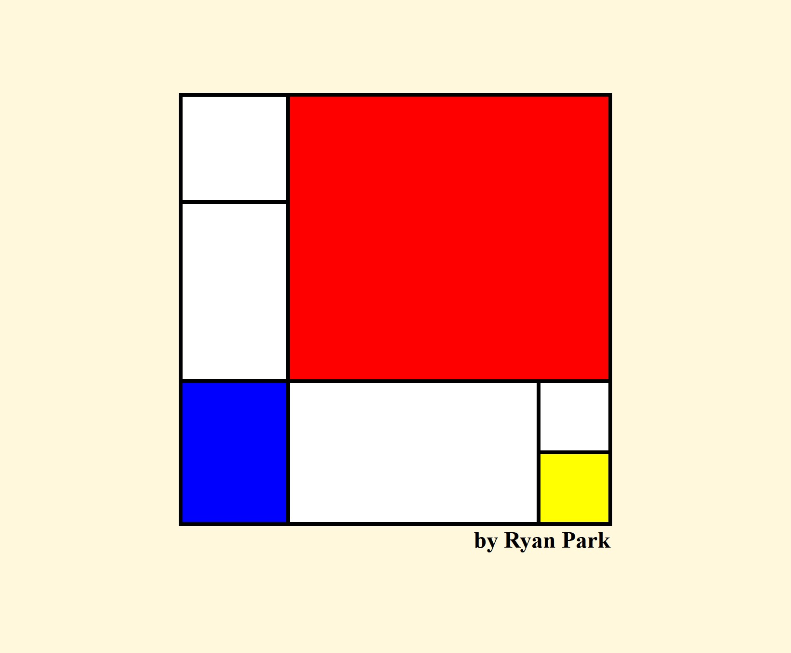
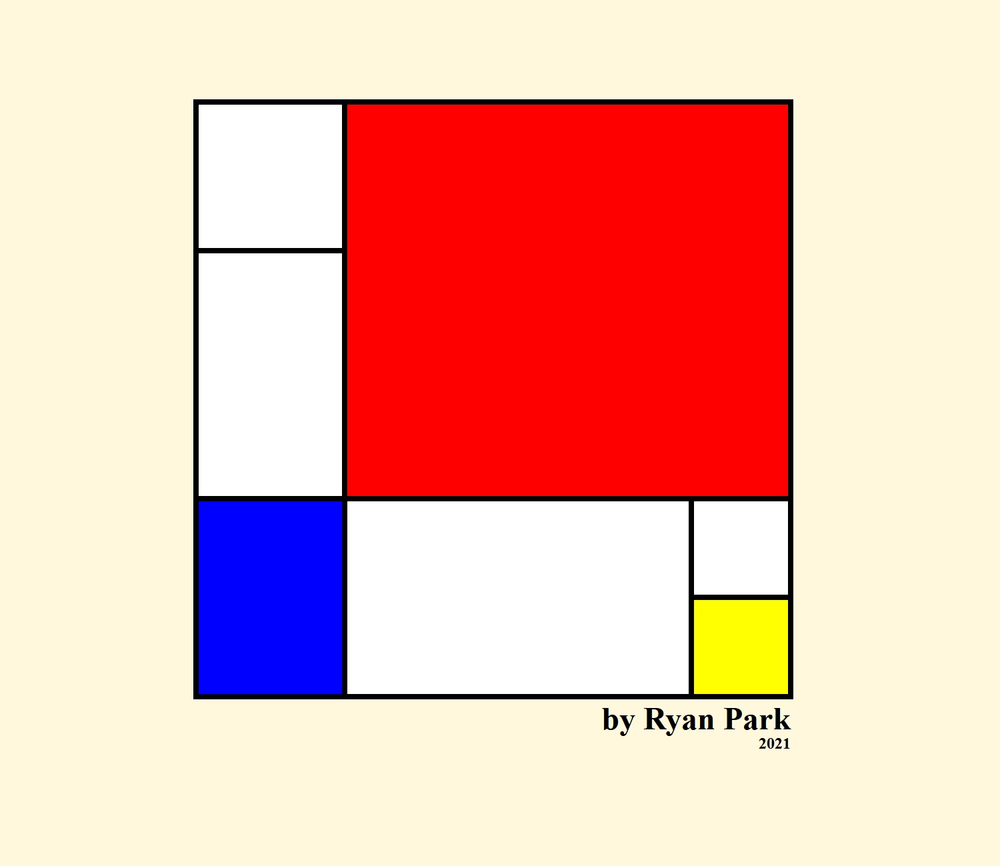
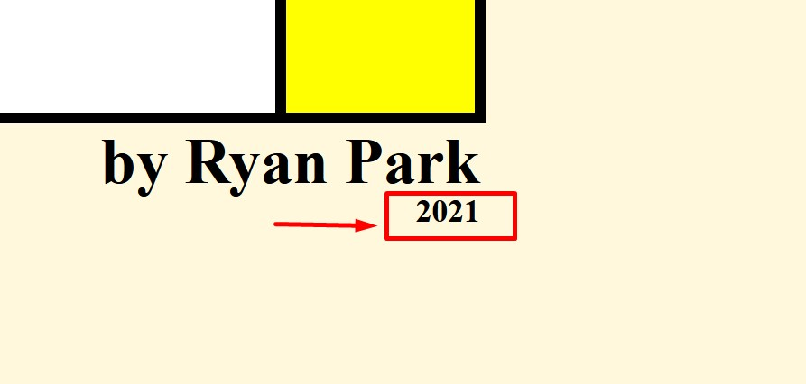

# Mondrian Painting

<!--  -->

> This is a CSS Grid project using HTML, CSS.

## Features

---

### CSS Features

- Responsive - Using Media Query

### Javascript Features

- Date in footer section

  

## Running the project

---

> Download or Clone the project and open index.html file or access directly [here](https://mondrian-css-grid.netlify.app/).

---

[Back To The Top](#read-me-template)
